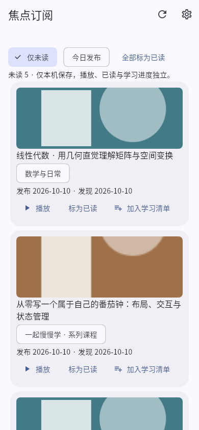
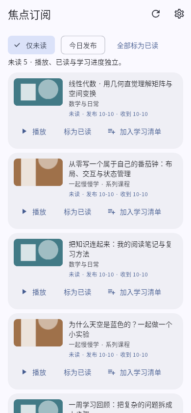
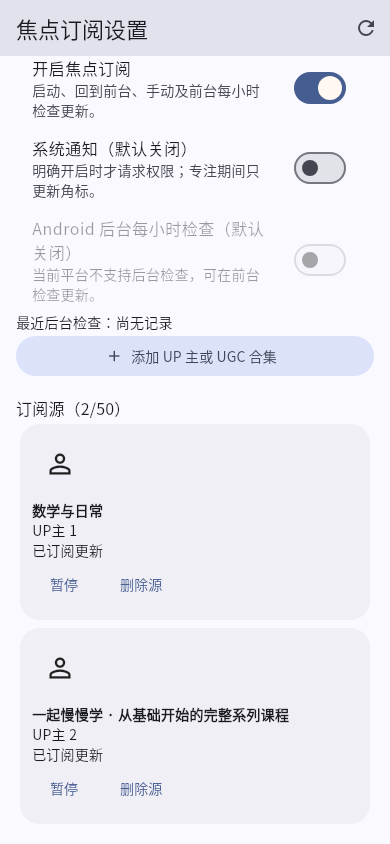
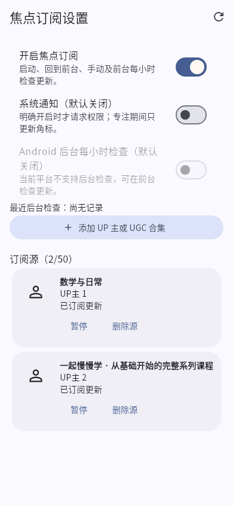

# 1.8.0 Beta3：焦点订阅与双击反馈

本轮基于重新 fetch 后的 `dev`：`dcb9368f`，独立分支 `codex/beta3-focus-performance`。`master` 为 `9156ad9`；Beta1、Beta2 已在 dev，开放 PR 查询为空。未合并 dev/master，未创建 release 或 tag。

## 实现

- 订阅列表缓存排序结果及未读数；无变化快照不重复解析、保存或通知界面。恢复前台由刷新路径统一重读，仍在每个跨进程边界读取 SQLite，在每次写入时执行原有 CAS，并保留重放、失效扫描隔离、去重和通知持久声明。
- SQLite 常规读取只返回当前值，恢复才读取备份。没有调整每源分页顺序、最多两个并行请求、小时冷却、失败退避、后台时限或后台轮换游标持久化。
- 刷新前筛出实际需要检查的来源；无到期来源时不进入转圈与通知流程。仅检查点改变时保持 feed 视图身份。重复标记已读不重写原已读时间。
- 更新列表采用 SliverList.builder 和稳定 BV key；缓存筛选结果。封面在左、主要信息在右，按钮允许换行。封面约束固定、按显示宽度解码，长标题保持完整语义文字。来源设置页同样改为左图右文。
- 自定义首页登记 `home.focus_subscriptions`，沿用原布局存储与显隐/排序机制，旧 ID 和隐藏项保留。显示最近三条收到的内容（包含已读），复用同一服务；挂载不轮询。提供空状态、刷新、完整列表和视频跳转，播放不会自动标记已读。
- 双击反馈原有重启动画和累加机制保留。修复宽窗口中方向动画被 620px 提示列限制、向播放器中央偏移的问题：方向动画现在直接使用控制栏之间的完整反馈区域，不受通知滚动列影响。不是“听视频进度”修复。

## 可复现性能证据

相同 Linux 环境、Flutter 3.44.6 / Dart 3.12.2；基线为 `dcb9368`。使用同一 `subscription_performance_probe_test.dart` 在独立基线 worktree 和修改后运行，无真实网络和账号数据。计数优先于墙钟耗时。

| 场景 | 修改前 | 修改后 |
|---|---:|---:|
| 500 条 feed，读取 1000 次产生的不同排序列表 | 1000 | 1 |
| 100 次无变化重读的界面通知 | 100 | 0 |
| 100 次无变化重读的事务回调 / save 回调 | 100 / 100 | 0 / 0 |
| 同一小时内 100 次自动刷新引发的界面通知 | 300 | 0 |
| 390×844 首屏预先创建的卡片 Widget | 500 | 4 |
| 首屏实际挂载的卡片 | 4 | 4 |
| 20 次同时刷新、20 个来源的网络请求 | 20 | 20 |
| 最大在途请求 | 2 | 2 |
| 同一小时内 100 次自动刷新网络请求 | 0 | 0 |

无变化 reload 前后均读取 100 次权威快照；修改后使用纯读取。原 SQLite 层已会跳过相同值更新，所以 **save 回调下降不等于 100 次实际磁盘写入被消除**。首屏比较是组件预创建次数，不宣称之前实际挂载了 500 行。单次微秒测量只供诊断，不作为设备耗电或真实接口延迟承诺。

原始数据：[修改前](performance-before.json)、[修改后](performance-after.json)。复现：

```sh
flutter test --no-pub --dart-define=PERF_OUTPUT=/tmp/focubili-perf.json test/subscription_performance_probe_test.dart
```

将该测试文件复制到 `dcb9368` 的独立 worktree、执行 pub get 后运行同一命令可重测基线。

## 验证

- 本地全量 `flutter test --no-pub --reporter expanded`：799 通过，1 项原有 Windows 字体依赖测试跳过。
- 定向 68 项通过：订阅服务、后台并发/CAS、页面、卡片、缓存/回滚、布局兼容与双击动画。
- `flutter analyze --no-pub` 无问题；`dart format --output=none --set-exit-if-changed lib test`、`git diff --check` 通过。
- Android JVM：9 个 suite、35 项测试，0 失败/错误/跳过；通用 debug 与三 ABI 分包构建成功。
- 新增宽屏鼠标用例在修复前失败：右边缘应为 1223，实为 929.5，偏差 293.5 px；修复后通过。覆盖同向连续双击、反向、旧计时器隔离、1600×1000→900×650 缩放、消失后重播及输入透传。
- 原有后台 restart、跨引擎已读合并、CAS 冲突回放、失败回滚和重复通知测试继续通过。本轮未运行真实 Android SQLite/WorkManager 进程测试，未进行真实 B 站接口性能测量。
- Windows CI 增加相关 widget 用例，再执行现有 Windows debug 原生构建。**没有 Windows 真机验收；Linux widget 测试、Windows CI 构建均不等于 Windows 真机视频播放验收。**

## 实际 Flutter 渲染截图

截图来自真实生产页面/组件，由 Flutter 测试引擎渲染，使用本地数据、合成横向/纵向封面和播放器替身。不是设计稿，也不是 Android/Windows 真机截图。卡片图展示真实卡片组件，宿主页标题为测试容器。

| 原布局 | 本轮布局 |
|---|---|
|  |  |
|  |  |

[320px / 180% 字号](feed-large-text.png) · [桌面深色列表](feed-desktop-dark.png) · [首页订阅卡片](card-mobile.png) · [深色卡片](card-desktop-dark.png)

[动画修复前](before-player-desktop-forward.png) · [动画修复后](player-desktop-forward.png)

```sh
flutter test --no-pub --dart-define=BETA3_CAPTURE_DIR=/tmp/beta3-ui test/subscription_compact_ui_test.dart test/support/beta3_player_capture.dart
```

截图模式的字体路径针对当前保存环境；正常测试不依赖这些路径。

## 安装包与签名

本地 ARM64：`FocuBili-1.8.0-beta.3-preview-arm64.apk`，`com.focubili.app.preview`，versionCode `2023`。精确大小、SHA-256 与公开证书见 [APK 核验记录](apk-verification.json)。沿用环境已有调试签名，证书与 `docs/beta/verification-beta2.json` 记录相同；未读取/生成/上传签名秘密，未改包名或签名配置。

环境没有正式 `android/key.properties`。本地 ARM64 包可用于同包、同证书且 versionCode 不更高的历史 ARM64 preview；实际已安装包尚未核验。不要为解决签名冲突而无备份卸载。

Library 保存尝试因授权不可用失败，本地文件保留在 `/workspace/scratch/focubili-beta3/`。远端测试交付使用本 draft PR 的既有 Actions artifacts：`focubili-debug-apk` / `focubili-debug-windows`（登录 GitHub 下载，保留 7 天）。CI 使用其原有临时 debug 签名，不能保证覆盖本地历史签名；CI 通用包 versionCode 为 `23`，也不能覆盖已安装的分包 `2022/2023`。具体产物证书与 hash 以各 artifact 的 `apk-verification.json` 为准。
